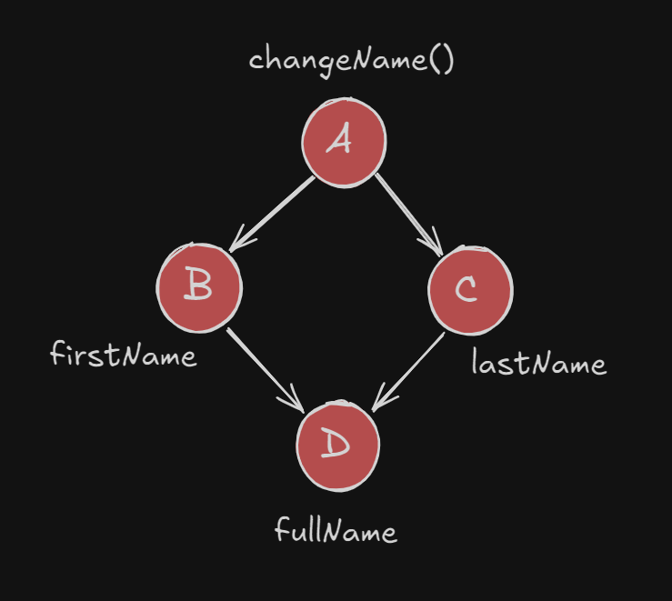
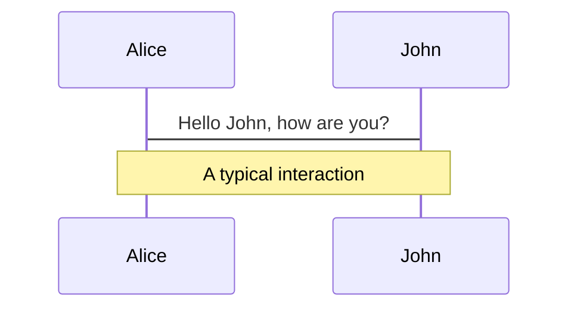
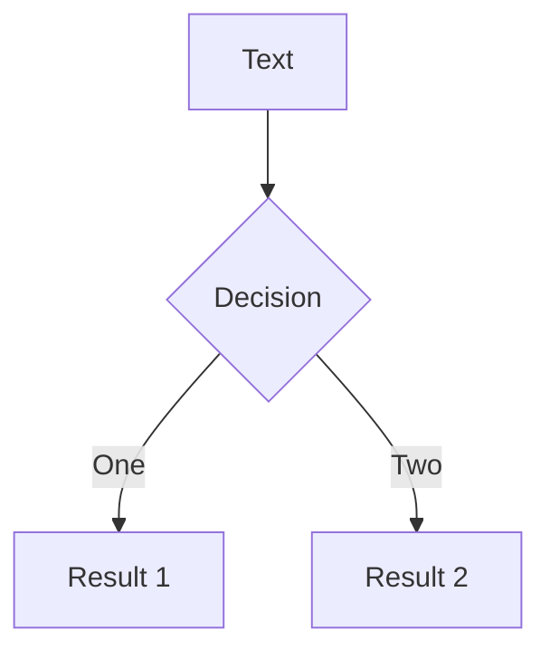
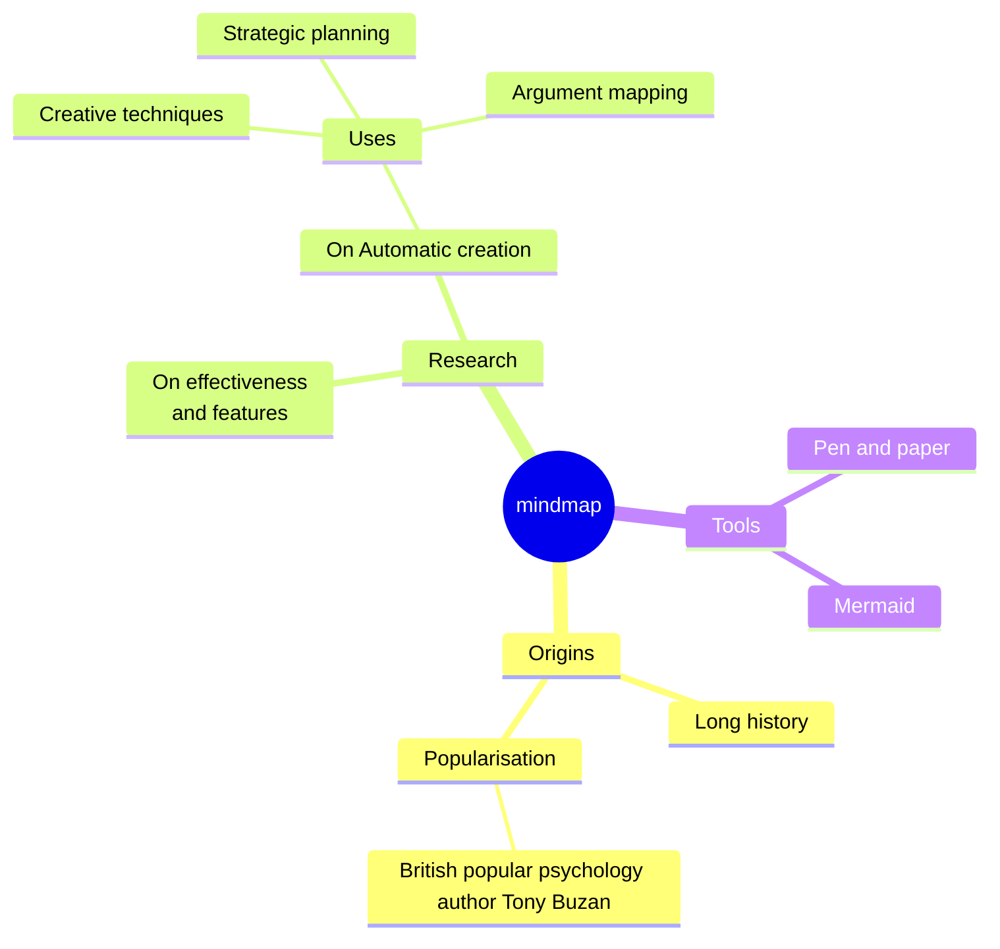
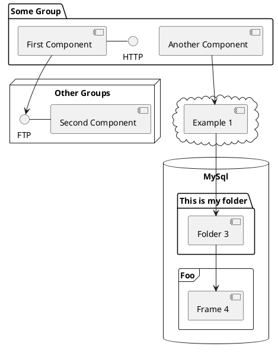

# Angular Signals

<p class="pb-32 opacity-75! text-xl">Concepts, best practices and patterns.</p>

<div class="absolute bottom-8 left-0 w-full opacity-50">
  <p class="text-sm italic">Presented with ❤️ by Grizzly devs</p>
</div>

<style>
h1 {
  background-color: #2B90B6;
  background-image: linear-gradient(45deg, #FA2C04 0%, #0546FF 100%);
  background-size: 100%;
  -webkit-background-clip: text;
  -moz-background-clip: text;
  -webkit-text-fill-color: transparent;
  -moz-text-fill-color: transparent;
  font-size: 5rem !important;
  line-height: 2 !important;
}
</style>


---
transition: fade-out
---

# What is a signal?

Let's start with a definition.

<div v-click>
  <p>A <span v-mark.red="+1">reactive</span> value which notifies consumers of any changes.</p>
</div>

<div v-click>
  <p>Signals are <span v-mark.red="+2">functions</span> which return their current value.</p>
</div>

<div v-click>
  <p>To access the current value of a signal: <span v-mark.red="+3">call it</span>.</p>
</div>

<br>

<v-click>

````md magic-move {lines:true}
```ts {1|4}
import { signal } from '@angular/core';

export class MyComponent {
  project = signal('Grizzly'); // WritableSignal<string>
}
```
```ts {6}
import { signal } from '@angular/core';

@Component({
  template: `
    I am currently working on:
    {{ project() }}
  `,
})
export class MyComponent {
  project = signal('Grizzly'); // WritableSignal<string>
}
```
````

</v-click>

---
transition: slide-left
---

# Why do we need them?

This question inevitably leads us to the topic of Change Detection.

<div v-click>
  Angular can <span v-mark.red="+1">track</span> where the signal is used.
</div>

<div v-click>
  By <span v-mark.red="+2">reacting</span> to the Signals, Angular knows exactly <span v-mark.red="+3">what to update and when</span>.
</div>

<br>

<div v-click="4">
  🔓 <span v-mark.red="+4" class="text-lg font-bold">Local Change Detection</span>: <span class="text-sm">Angular knows exactly which components should be re-rendered.</span>
</div>

<br>


```ts {1,4,7,11}{lines:true}
import { signal } from '@angular/core';

@Component({
  changeDetection: ChangeDetectionStrategy.OnPush,
  template: `
    I am currently working on:
    {{ project() }}
  `,
})
export class MyComponent {
  project = signal('Grizzly'); // WritableSignal<string>
}
```

---
transition: slide-left
---

# Modify Signal Value

How to modify the value of a signal?

A `WritableSignal` can be updated with a new value in 2 ways:

<v-click>

#### 1. Directly set the signal to a new value

````md magic-move {lines:true}
```ts {*|5|none|none}
selectedItemId = signal(0);

selectItem(id: string) {
  console.log(`Updating selected item...`)
  this.selectedItemId.set(id);
}

```
````

</v-click>

<br>

<v-click at="3">

#### 2. Update the value based on its current value

````md magic-move {at:4, lines:true}
```ts {*|5}
counter = signal(0);

increment() {
  console.log(`Updating counter...`)
  this.counter.update((currentCount) => currentCount + 1);
}

```
````

</v-click>


---
transition: slide-left
---

# Hands-On Time

## Clone repo

To get started, clone the repo:

```bash
git clone https://github.com/kfrederix/angular-signals-workshop.git
cd angular-signals-workshop
pnpm i
```

[https://github.com/kfrederix/angular-signals-workshop](https://github.com/kfrederix/angular-signals-workshop)


<style>
  img[alt="QR code for Angular Signals Workshop github repo"] {
    height: 150px;
  }
</style>


---
transition: slide-left
---

# Excercise 1 - The Basics

## Instructions

https://github.com/kfrederix/angular-signals-workshop#exercises

The instructions for each exercise can be found in the corresponding `README.md` file in each app folder.

```
apps
│
└── 01-basics
    │   ...
    ├── README.md
    ...

```

<br>


## Run app

```bash
pnpm start basics
```

---
transition: slide-left
---

# Reactive Derived Values

Signals are cool, but _derived signals_ are even better 😎

<p class="text-sm">What if we need a <span class="italic">derived</span> value that is always up-to-date when the signal changes?</p>


````md magic-move {at:1, lines:true}
```ts {1-6|1-7,10|1-7,10}
import { computed, signal } from '@angular/core';

counter: WritableSignal<number> = signal(0);

// DERIVED from this.counter - NOT writable
doubleCount: Signal<number> = computed(() => this.counter() * 2);

increment() {
  console.log(`Updating counter...`)
  this.counter.update((currentCount) => currentCount + 1 );
}

```
````

<br>

<v-click at="2">

## Extra Features

- Lazy Evaluation - <span class="text-sm opacity-50">only runs when value is read</span>
- Memoization - <span class="text-sm opacity-50">cached until source signal(s) changed</span>

</v-click>


---
transition: slide-left
---

# Reactive Derived Values - Pitfall

Watch out with conditional logic inside `computed()`

<div class="text-sm">When <span v-mark.red="+1">initial execution</span> of computed function does not <span v-mark.red="+1">read the signal</span>,</div>
<div class="text-sm">Angular can not track it.</div>

<br>

```ts {1-12}{lines: true}
counter = signal(0);
shouldDouble = false;

// does NOT work
doubleCountOrZero = computed(() => {
  if (!shouldDouble) {
    // in this case: no signal was read
    // so Angular does not know that this fn depends on count()
    return 0;
  }
  return this.count() * 2;
});

increment() {
  console.log(`Updating counter...`)
  this.counter.update((currentCount) => currentCount + 1 );
}

```

---
transition: slide-left
---

# Best-Practice Pattern For `computed()`

Avoid suprises (bugs) by applying this pattern.

<br>

````md magic-move {lines:true}
```ts
counter = signal(0);

doubleCount = computed(() => {
  // 1. read all signals first
  const count = this.counter();

  // 2. computation here - no more signal reads
  return count * 2;
});

```
```ts
counter = signal(0);

// OK to skip it for really simple one-liners
doubleCount = computed(() => this.counter() * 2);

```
```ts {*|1-2,6-7,9,14}
// BAD EXAMPLE - AVOID THIS
reallyAwesomeThing = computed(() => this.reallyAwesomeCalculation());

private reallyAwesomeCalculation() {
  return [
    this.firstThing(),
    this.secondThing(),
  ]
  .map((thing) => this.combineWithThirdThing(thing))
  .reduce((prevResult, currentVal) => prevResult + currentVal, 0);
}

private combineWithThirdThing(value) {
  return value * this.thirdThing();
}

```
```ts
// BETTER - MAKE SOURCE SIGNALS EXPLICIT
reallyAwesomeThing = computed(() => {
  // 1. read all source signals
  const firstThing = this.firstThing();
  const secondThing = this.secondThing();
  const thirdThing = this.thirdThing();

  // 2. pass plain values as arguments
  return this.reallyAwesomeCalculation(firstThing, secondThing, thirdThing);
});

private reallyAwesomeCalculation(firstThing, secondThing, thirdThing) {
  // NO more signal reads here
}

```
```ts
// BEST - NO ADDITIONAL CLASS METHOD CALLS
reallyAwesomeThing = computed(() => {
  // 1. read all the signals
  const firstThing = this.firstThing();
  const secondThing = this.secondThing();
  const thirdThing = this.thirdThing();
  
  // 2. computation here - no more signal reads
  return [firstThing, secondThing]
    .map((thing) => thing * thirdThing)
    .reduce((prevResult, currentVal) => prevResult + currentVal, 0);
});

```
```ts
import { reallyAwesomeCalculation } from './awesome-stuff.util';

export class MyCompponent {
  // BEST - No additional CLASS METHOD calls
  reallyAwesomeThing = computed(() => {
    // 1. read all the signals
    const firstThing = this.firstThing();
    const secondThing = this.secondThing();
    const thirdThing = this.thirdThing();
    
    // 2. computation here - no more signal reads
    return reallyAwesomeCalculation(firstThing, secondThing, thirdThing);
  });
}

```
````


---
transition: slide-left
---

# Excercise 2 - Derived Values

## Instructions

https://github.com/kfrederix/angular-signals-workshop#exercises

```
apps
│
└── 02-derived-values
    │   ...
    ├── README.md
    ...

```

<br>

## Run app

```bash
pnpm start derived-values
```

---
transition: fade-out
---

# Effect

Execute some side-effects when one or more signal values change.

- Runs at least once
- Tracks any signal value reads
- Executes asynchronously - <span class="text-sm opacity-50">during change detection process</span>

<br>


```ts {*}{lines: true}
import { effect } from '@angular/core';

effect(() => {
  // runs on component init, PLUS each time when count changes
  console.log(`The current count is: ${count()}`);
});

```

---
transition: slide-left
---

# Effect

Rarely needed in most apps. Use with care.


## Discouraged

❌ Usage of `effect()` is generally discouraged by Angular team.

💡 First consider if `computed()` could be a better fit.

<v-click>

## Example Use Cases

<br>

- Logging
- Syncing data with `window.localStorage`
- Custom DOM behavior - <span class="text-sm opacity-50">like changing background color based on State</span>
- Custom rendering - <span class="text-sm opacity-50">like drawing on a canvas whenever a signal changes</span>

</v-click>


---
transition: slide-left
layout: two-cols
---

# Glitch-Free Execution

Solving the diamond problem.

```ts {*}{lines:true}
firstName = signal('Peter');
lastName = signal('Parker');

fullName = computed(() => 
  `${this.firstName()} ${this.lastName()}`
);

changeName() {
  this.firstName.set('Spider');
  this.lastName.set('Man');
}

constructor() {
  effect(() => {
    console.log(`Full name is: ${this.fullName()}`);
    // 1. LOG: Full name is: Peter Parker
    // changeName()
    // 2. LOG: Full name is: Spider Man
  });
}
```

::right::

<div class="h-80 mt-20 ">
  
</div>


---
transition: slide-up
level: 2
---

# Navigation

Hover on the bottom-left corner to see the navigation's controls panel, [learn more](https://sli.dev/guide/ui#navigation-bar)

## Keyboard Shortcuts

|     |     |
| --- | --- |
| <kbd>right</kbd> / <kbd>space</kbd>| next animation or slide |
| <kbd>left</kbd>  / <kbd>shift</kbd><kbd>space</kbd> | previous animation or slide |
| <kbd>up</kbd> | previous slide |
| <kbd>down</kbd> | next slide |

<!-- https://sli.dev/guide/animations.html#click-animation -->

<p v-after class="absolute bottom-23 left-45 opacity-30 transform -rotate-10">Here!</p>

---
layout: two-cols
layoutClass: gap-16
---

# Table of contents

You can use the `Toc` component to generate a table of contents for your slides:

```html
<Toc minDepth="1" maxDepth="1"></Toc>
```

The title will be inferred from your slide content, or you can override it with `title` and `level` in your frontmatter.

::right::

<Toc v-click minDepth="1" maxDepth="2"></Toc>

---
layout: image-right
image: https://cover.sli.dev
---

# Code

Use code snippets and get the highlighting directly, and even types hover!

```ts {all|5|7|7-8|10|all} twoslash
// TwoSlash enables TypeScript hover information
// and errors in markdown code blocks
// More at https://shiki.style/packages/twoslash

import { computed, ref } from 'vue'

const count = ref(0)
const doubled = computed(() => count.value * 2)

doubled.value = 2
```

<arrow v-click="[4, 5]" x1="350" y1="310" x2="195" y2="334" color="#953" width="2" arrowSize="1" />

<!-- This allow you to embed external code blocks -->
<<< @/snippets/external.ts#snippet

<!-- Footer -->

[Learn more](https://sli.dev/features/line-highlighting)

<!-- Inline style -->
<style>
.footnotes-sep {
  @apply mt-5 opacity-10;
}
.footnotes {
  @apply text-sm opacity-75;
}
.footnote-backref {
  display: none;
}
</style>

<!--
Notes can also sync with clicks

[click] This will be highlighted after the first click

[click] Highlighted with `count = ref(0)`

[click:3] Last click (skip two clicks)
-->

---
level: 2
---

# Shiki Magic Move

Powered by [shiki-magic-move](https://shiki-magic-move.netlify.app/), Slidev supports animations across multiple code snippets.

Add multiple code blocks and wrap them with <code>````md magic-move</code> (four backticks) to enable the magic move. For example:

````md magic-move {lines: true}
```ts {*|2|*}
// step 1
const author = reactive({
  name: 'John Doe',
  books: [
    'Vue 2 - Advanced Guide',
    'Vue 3 - Basic Guide',
    'Vue 4 - The Mystery'
  ]
})
```

```ts {*|1-2|3-4|3-4,8}
// step 2
export default {
  data() {
    return {
      author: {
        name: 'John Doe',
        books: [
          'Vue 2 - Advanced Guide',
          'Vue 3 - Basic Guide',
          'Vue 4 - The Mystery'
        ]
      }
    }
  }
}
```

```ts
// step 3
export default {
  data: () => ({
    author: {
      name: 'John Doe',
      books: [
        'Vue 2 - Advanced Guide',
        'Vue 3 - Basic Guide',
        'Vue 4 - The Mystery'
      ]
    }
  })
}
```

Non-code blocks are ignored.

```vue
<!-- step 4 -->
<script setup>
const author = {
  name: 'John Doe',
  books: [
    'Vue 2 - Advanced Guide',
    'Vue 3 - Basic Guide',
    'Vue 4 - The Mystery'
  ]
}
</script>
```
````

---

# Components

<div grid="~ cols-2 gap-4">
<div>

You can use Vue components directly inside your slides.

We have provided a few built-in components like `<Tweet/>` and `<Youtube/>` that you can use directly. And adding your custom components is also super easy.

```html
<Counter :count="10" />
```

<!-- ./components/Counter.vue -->
<Counter :count="10" m="t-4" />

Check out [the guides](https://sli.dev/builtin/components.html) for more.

</div>
<div>

```html
<Tweet id="1390115482657726468" />
```

<Tweet id="1390115482657726468" scale="0.65" />

</div>
</div>

<!--
Presenter note with **bold**, *italic*, and ~~striked~~ text.

Also, HTML elements are valid:
<div class="flex w-full">
  <span style="flex-grow: 1;">Left content</span>
  <span>Right content</span>
</div>
-->

---
class: px-20
---

# Themes

Slidev comes with powerful theming support. Themes can provide styles, layouts, components, or even configurations for tools. Switching between themes by just **one edit** in your frontmatter:

<div grid="~ cols-2 gap-2" m="t-2">

```yaml
---
theme: default
---
```

```yaml
---
theme: seriph
---
```


</div>

Read more about [How to use a theme](https://sli.dev/guide/theme-addon#use-theme) and
check out the [Awesome Themes Gallery](https://sli.dev/resources/theme-gallery).

---

# Clicks Animations

You can add `v-click` to elements to add a click animation.

<div v-click>

This shows up when you click the slide:

```html
<div v-click>This shows up when you click the slide.</div>
```

</div>

<br>

<v-click>

The <span v-mark.red="3"><code>v-mark</code> directive</span>
also allows you to add
<span v-mark.circle.orange="4">inline marks</span>
, powered by [Rough Notation](https://roughnotation.com/):

```html
<span v-mark.underline.orange>inline markers</span>
```

</v-click>

<div mt-20 v-click>

[Learn more](https://sli.dev/guide/animations#click-animation)

</div>

---

# Motions

Motion animations are powered by [@vueuse/motion](https://motion.vueuse.org/), triggered by `v-motion` directive.

```html
<div
  v-motion
  :initial="{ x: -80 }"
  :enter="{ x: 0 }"
  :click-3="{ x: 80 }"
  :leave="{ x: 1000 }"
>
  Slidev
</div>
```

<div class="w-60 relative">
  <div class="relative w-40 h-40">
    
    
    
  </div>

  <div
    class="text-5xl absolute top-14 left-40 text-[#2B90B6] -z-1"
    v-motion
    :initial="{ x: -80, opacity: 0}"
    :enter="{ x: 0, opacity: 1, transition: { delay: 2000, duration: 1000 } }">
    Slidev
  </div>
</div>

<!-- vue script setup scripts can be directly used in markdown, and will only affects current page -->
<script setup lang="ts">
const final = {
  x: 0,
  y: 0,
  rotate: 0,
  scale: 1,
  transition: {
    type: 'spring',
    damping: 10,
    stiffness: 20,
    mass: 2
  }
}
</script>

<div
  v-motion
  :initial="{ x:35, y: 30, opacity: 0}"
  :enter="{ y: 0, opacity: 1, transition: { delay: 3500 } }">

[Learn more](https://sli.dev/guide/animations.html#motion)

</div>

---

# LaTeX

LaTeX is supported out-of-box. Powered by [KaTeX](https://katex.org/).

<div h-3 />

Inline $\sqrt{3x-1}+(1+x)^2$

Block
$$ {1|3|all}
\begin{aligned}
\nabla \cdot \vec{E} &= \frac{\rho}{\varepsilon_0} \\
\nabla \cdot \vec{B} &= 0 \\
\nabla \times \vec{E} &= -\frac{\partial\vec{B}}{\partial t} \\
\nabla \times \vec{B} &= \mu_0\vec{J} + \mu_0\varepsilon_0\frac{\partial\vec{E}}{\partial t}
\end{aligned}
$$

[Learn more](https://sli.dev/features/latex)

---

# Diagrams

You can create diagrams / graphs from textual descriptions, directly in your Markdown.

<div class="grid grid-cols-4 gap-5 pt-4 -mb-6">









</div>

Learn more: [Mermaid Diagrams](https://sli.dev/features/mermaid) and [PlantUML Diagrams](https://sli.dev/features/plantuml)

---
foo: bar
dragPos:
  square: 718,120,167,_,-16
---

# Draggable Elements

Double-click on the draggable elements to edit their positions.

<br>

###### Directive Usage

```md

```

<br>

###### Component Usage

```md
<v-drag text-3xl>
  <carbon:arrow-up />
  Use the `v-drag` component to have a draggable container!
</v-drag>
```

<v-drag pos="641,410,261,_,-15"undefinedundefinedundefinedundefinedundefinedundefinedundefinedundefinedundefinedundefinedundefinedundefinedundefinedundefinedundefinedundefinedundefinedundefinedundefinedundefinedundefinedundefinedundefinedundefinedundefinedundefinedundefinedundefinedundefinedundefinedundefinedundefinedundefinedundefinedundefinedundefinedundefinedundefinedundefinedundefinedundefinedundefinedundefinedundefinedundefinedundefinedundefinedundefinedundefinedundefinedundefinedundefinedundefinedundefinedundefinedundefinedundefinedundefinedundefinedundefinedundefinedundefinedundefinedundefinedundefinedundefinedundefinedundefinedundefinedundefinedundefinedundefinedundefinedundefinedundefinedundefinedundefinedundefinedundefinedundefinedundefinedundefinedundefinedundefinedundefinedundefined>
  <div text-center text-3xl border border-main rounded>
    Double-click me!
  </div>
</v-drag>


###### Draggable Arrow

```md
<v-drag-arrow two-way />
```

<v-drag-arrow pos="116,472,348,3" two-way op70 />

---
src: ./pages/imported-slides.md
hide: false
---

---

# Monaco Editor

Slidev provides built-in Monaco Editor support.

Add `{monaco}` to the code block to turn it into an editor:

```ts {monaco}
import { ref } from 'vue'
import { emptyArray } from './external'

const arr = ref(emptyArray(10))
```

Use `{monaco-run}` to create an editor that can execute the code directly in the slide:

```ts {monaco-run}
import { version } from 'vue'
import { emptyArray, sayHello } from './external'

sayHello()
console.log(`vue ${version}`)
console.log(emptyArray<number>(10).reduce(fib => [...fib, fib.at(-1)! + fib.at(-2)!], [1, 1]))
```

---
layout: center
class: text-center
---

# Learn More

[Documentation](https://sli.dev) · [GitHub](https://github.com/slidevjs/slidev) · [Showcases](https://sli.dev/resources/showcases)

<PoweredBySlidev mt-10 />
